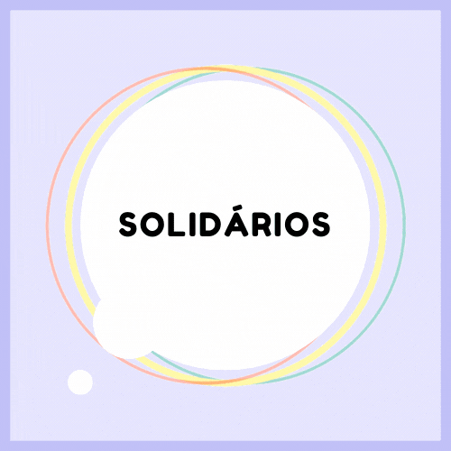

<!-- <h1>Solidários</h1>  -->

<h2 style="text-align:center;margin-top:30px;margin-bottom:25px;">O que é o Solidários? </h2>

"O **Solidários** é um site que tive que produzir no curso de **Informática para Internet**, nas matérias de Programação Web 1, Desenvolvimento e Desing de Websites Modelagem e Desenvolvimento de Banco de Dados. É um site de doações de alimentos para um projeto da minha escola (**o trote solidário**).

É meu **primeiro** projeto grande no curso, então os códigos estão um pouco mal organizados, não são responsivos e ainda apresentam alguns bugs, mas que serão corrigidos com o tempo
algumas páginas estão incompletas, mas **estão** sendo terminadas com o tempo." - @blaxprism

<h2
    style="text-align:center;margin-top:30px;margin-bottom:25px;">
    Como ele funciona?
</h2>

**Descrição de como ele funciona e com imagens**

<h2 style="text-align:center;margin-top:40px;margin-bottom:25px;">Para contribuir com o projeto: </h2>

- De um star e faça um fork nesse repositorio;

- clone o repositorio;

- Abra uma PR (Pull Request)

E pronto você **contribuiu**!

<h2 style="text-align:center;margin-top:40px;margin-bottom:25px;">Contate-nos! 📧</h2>

**Email:** lorem@gmail.com

**Discord:** #Morkets Gutt

<h2 style="text-align:center;margin-top:40px;margin-bottom:25px;">Address</h2>

**Author:**  _@blaxprism_

**Repo Original:**  [blaxprism/Solidarios/](https://github.com/blaxprism/Solidarios/)

---

**Contribuidor:**  _@msNullus_
